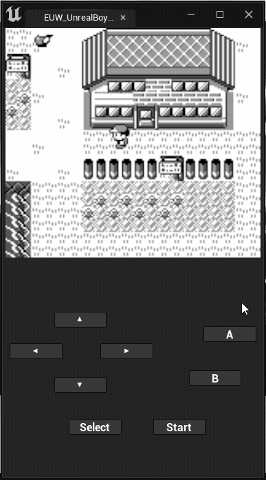

# Unreal Boy

Yet another game boy emulator written in Unreal C++. 

Features list:

- ✅ Motherboard
- ✅ CPU
- ✅ LCD
- ✅ Timer
- Cartridge
  - ✅ MBC ROM Only
  - ✅ MBC 1
  - ❓  MBC 2 (Need test)
  - ✅ MBC 3
  - ❌ MBC 5
- ✅ Input
- ✅ Load & Save
- ❌ Audio
- ❌ RTC
- ✅ Emulator Actor
- ✅ Emulator UMG Widget

## Installation

1. Clone or download this repository  
2. Place it into unreal project plugins directory
3. Compile your project and launch the editor
4. Open the level "Map_UnrealBoy_Playground" and play it!

## References

https://github.com/Baekalfen/PyBoy

https://gbdev.io/pandocs/Specifications.html
